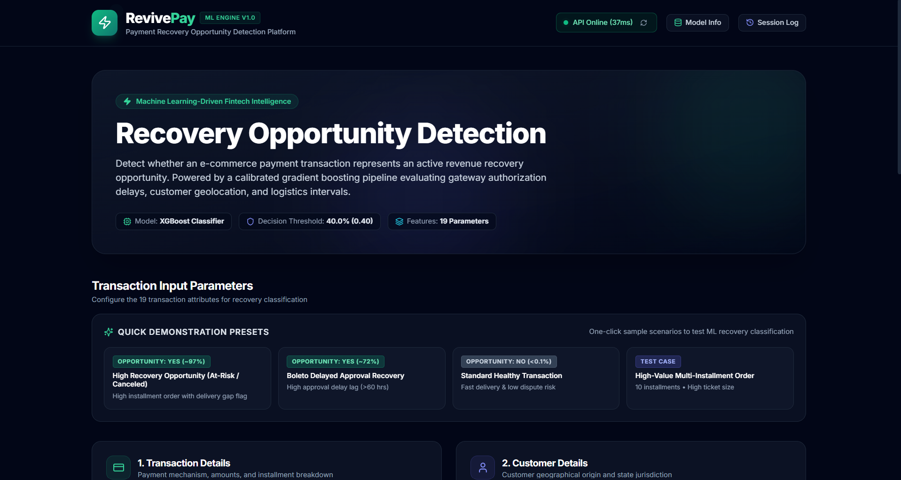
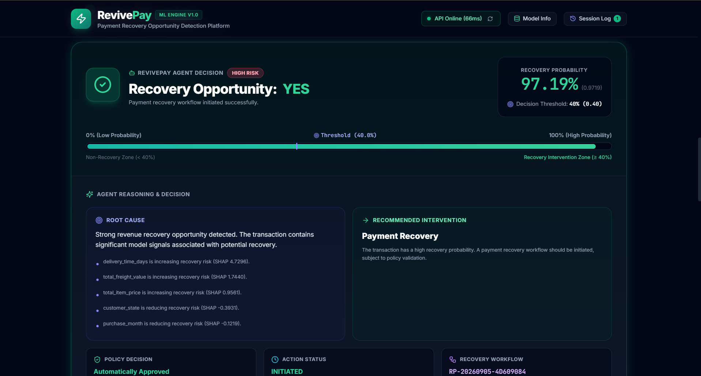
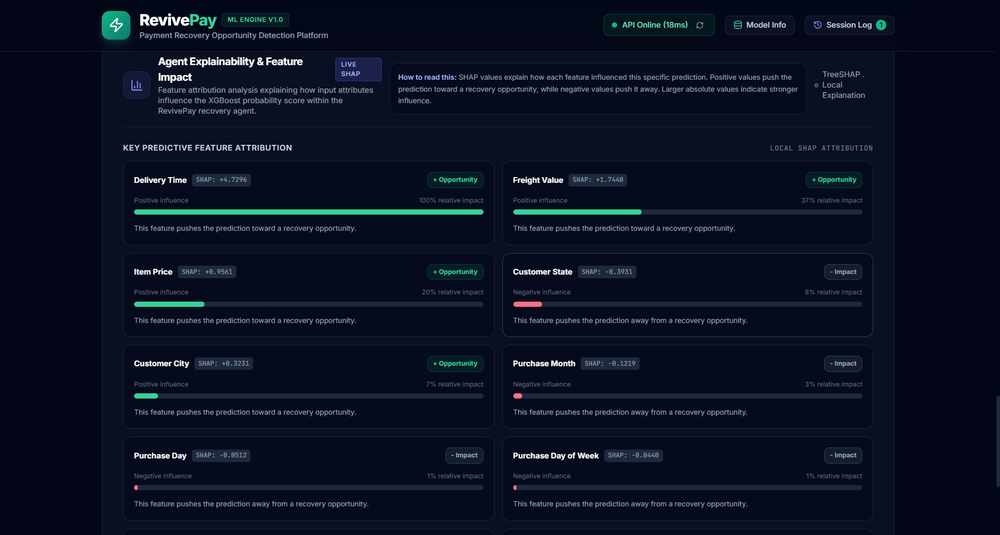
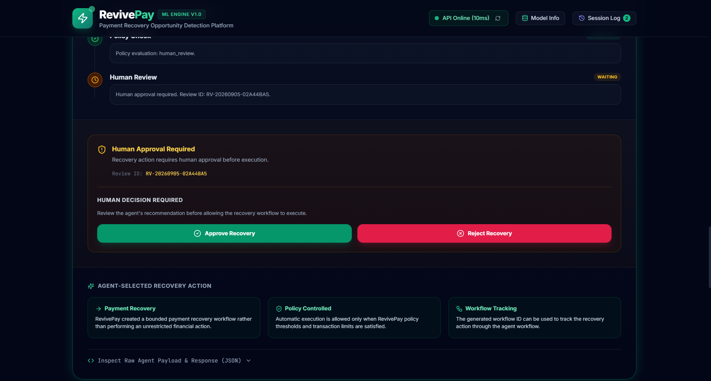
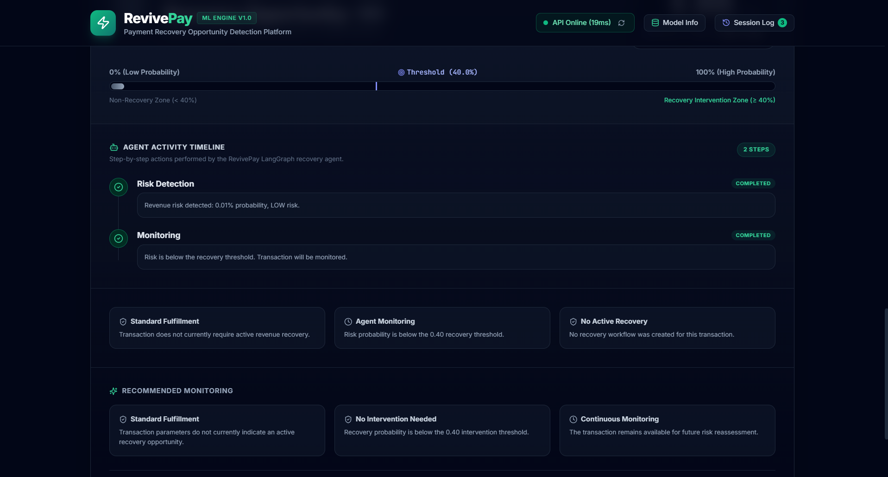
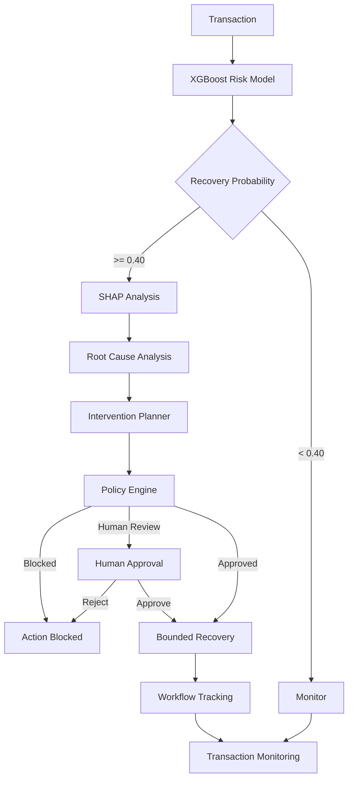
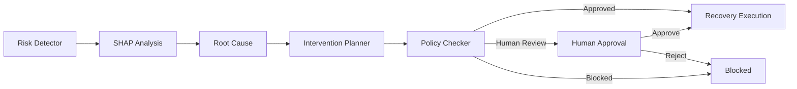
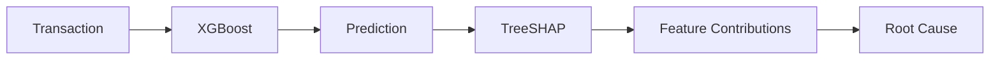
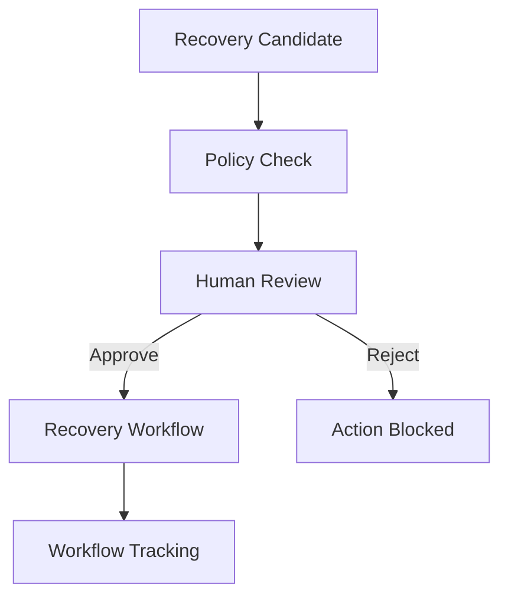
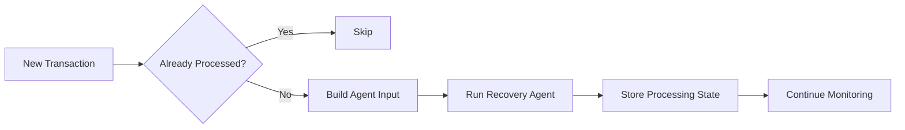

# 💰 RevivePay — AI Revenue Recovery Agent

<p align="center">
  <strong>Detect revenue at risk. Understand why. Decide what to do. Recover it safely.</strong>
</p>

<p align="center">
  An end-to-end AI revenue recovery platform combining
  <strong>XGBoost</strong>, <strong>SHAP</strong>, <strong>LangGraph</strong>,
  policy guardrails, Human-in-the-Loop approval, bounded recovery workflows,
  and transaction monitoring.
</p>

<p align="center">
  
  
  
  
  
  
  
</p>

---

## 🚀 What is RevivePay?

**RevivePay** is an AI-powered revenue recovery platform that detects transactions where revenue may be at risk and determines the appropriate recovery action.

Unlike a traditional machine-learning system that stops at:

```text
Transaction → Model → Prediction
```

RevivePay creates a complete decision loop:

```text
Detect → Explain → Diagnose → Decide → Guardrail → Act → Monitor
```

The goal is simple:

> **Find revenue that's slipping away — and win it back responsibly.**

---

# 📸 Product Showcase

## 🖥️ RevivePay Dashboard

<p align="center">
  
</p>

The dashboard provides transaction inputs, demonstration scenarios, recovery probability, agent reasoning, policy decisions, workflow tracking, and explainability.

---

## 🔴 High-Risk Recovery Decision

<p align="center">
  
</p>

Example live result from the RevivePay agent:

| Decision | Result |
|---|---|
| Recovery Probability | **97.19%** |
| Risk Level | **HIGH** |
| Recommended Intervention | **Payment Recovery** |
| Policy Decision | **Automatically Approved** |
| Action Status | **INITIATED** |
| Recovery Workflow | `RP-...` |

---

## 🔍 Explainable AI with SHAP

<p align="center">
  
</p>

RevivePay uses **TreeSHAP** to explain individual predictions.

For example, a high-risk transaction can show:

```text
Delivery Time       → Positive impact
Freight Value       → Positive impact
Item Price          → Positive impact
Customer State      → Negative impact
Purchase Month      → Negative impact
```

This allows the system to answer not only:

> **"Is revenue at risk?"**

but also:

> **"Why does the model think so?"**

---

## 👤 Human-in-the-Loop

<p align="center">
  
</p>

RevivePay does not allow every AI recommendation to execute automatically.

When a transaction exceeds the autonomous execution policy, the system creates a human review request.

The reviewer can:

**Approve Recovery** → bounded recovery workflow initiated

**Reject Recovery** → recovery action blocked

This provides:

> **AI efficiency + human oversight**

---

## 📊 Transaction Monitoring

<p align="center">
  
</p>

RevivePay supports simulated transaction-stream processing.

Transactions are continuously evaluated and routed according to their risk:

```text
🟢 LOW
   ↓
Monitoring

🟡 MEDIUM
   ↓
Human Review

🔴 HIGH
   ↓
Policy Evaluation
   ↓
Bounded Recovery Workflow
```

This turns RevivePay into a continuous revenue recovery loop rather than a one-time prediction system.

---

# 🏗️ System Architecture



---

# 🤖 Agent Architecture

RevivePay uses **LangGraph** to orchestrate the complete recovery decision process.



### Agent responsibilities

| Agent Stage | Responsibility |
|---|---|
| Risk Detector | Estimates recovery probability |
| SHAP Analysis | Explains model prediction |
| Root Cause | Converts signals into structured reasoning |
| Intervention Planner | Selects appropriate recovery action |
| Policy Checker | Determines whether action is allowed |
| Human Review | Provides oversight for sensitive cases |
| Recovery Execution | Creates bounded recovery workflow |
| Monitoring | Continues transaction evaluation |

---

# 🧠 Machine Learning

## XGBoost Recovery Classifier

The ML engine predicts:

```text
recovery_opportunity
```

using **19 transaction features**.

### Model Configuration

| Parameter | Value |
|---|---|
| Algorithm | XGBoost Classifier |
| Features | 19 |
| Decision Threshold | **0.40** |
| Target | `recovery_opportunity` |

### Features

```text
total_payment_value
payment_count
payment_installments
primary_payment_type
item_count
total_item_price
total_freight_value
unique_products
unique_sellers
customer_city
customer_state
purchase_year
purchase_month
purchase_day
purchase_dayofweek
purchase_hour
approval_delay_hours
delivery_time_days
estimated_delivery_gap_days
```

Target and derived revenue-risk fields are excluded from model inputs to avoid data leakage.

---

# 📈 Model Performance

The tuned XGBoost model achieved strong test-set performance:

| Metric | Score |
|---|---:|
| Precision | **94.41%** |
| Recall | **68.70%** |
| F1 Score | **79.53%** |
| ROC-AUC | **99.81%** |
| PR-AUC | **89.82%** |

### Operating Threshold

**0.40**

The threshold was selected to identify recovery opportunities while keeping the recovery workflow controlled.

---

# 🔍 Explainability

RevivePay integrates **TreeSHAP** directly into the agent pipeline.



The dashboard displays:

- Top positive drivers
- Top negative drivers
- SHAP values
- Relative feature impact
- Transaction-specific explanations

This makes the ML decision transparent and auditable.

---

# 🎯 Intervention Planning

Based on the transaction context and model signals, RevivePay can select bounded interventions such as:

```text
payment_recovery
checkout_recovery
subscription_recovery
```

The selected intervention is then evaluated by the policy engine before execution.

---

# 🛡️ Policy & Guardrails

A central design principle of RevivePay is:

> **The AI can recommend actions, but policy controls what it is allowed to execute.**

The policy engine evaluates:

- Recovery probability
- Intervention type
- Transaction value
- Automatic execution rules
- Human-review requirements

### Example Policy

| Condition | Decision |
|---|---|
| Probability < 0.40 | Monitor / No Recovery |
| Probability ≥ 0.40 | Recovery Candidate |
| Probability < 0.80 | Human Review |
| Transaction Value > $500 | Human Review |
| Subscription Recovery | Human Review |
| Safe Payment / Checkout Recovery | Automatic Execution |

Policy configuration:

```text
config/recovery_policy.json
```

---

# 👤 Human-in-the-Loop Workflow

Sensitive actions are routed through human approval.



This creates a clear separation between:

**AI recommendation**

and

**authorized execution**

---

# ⚙️ Bounded Recovery Execution

RevivePay intentionally does **not** perform unrestricted financial actions.

The prototype does not:

- Charge customer cards
- Transfer money
- Issue unrestricted refunds
- Modify financial accounts
- Perform destructive financial operations

Instead, it creates controlled recovery workflow records.

Example:

```text
RP-20260905-A3399B33
```

This demonstrates agentic execution while keeping the system safe and bounded.

---

# 📋 Agent Activity Timeline

Every major decision step is recorded and exposed in the dashboard.

Example:

```text
✓ Risk Detection
✓ SHAP Analysis
✓ Root Cause
✓ Intervention Planning
✓ Policy Check
✓ Policy Approved
✓ Recovery Execution
```

This provides an auditable trail of how the agent reached and executed its decision.

---

# 🌊 Transaction Stream & Monitoring

RevivePay supports simulated transaction-stream processing.



### Risk-Based Routing

```text
LOW
 ↓
Monitor

MEDIUM
 ↓
Human Review

HIGH
 ↓
Policy Check
 ↓
Recovery Workflow
```

This enables RevivePay to continuously triage potential revenue recovery opportunities.

---

# 🖥️ Technology Stack

| Layer | Technologies |
|---|---|
| Machine Learning | Python, XGBoost, Scikit-learn |
| Explainability | SHAP / TreeSHAP |
| Agentic AI | LangGraph |
| Backend | FastAPI, Pydantic |
| Frontend | React, TypeScript, Vite |
| UI | Tailwind CSS |
| Data | Pandas, NumPy |
| Model Serialization | Joblib |
| Development | Git, VS Code, Jupyter |

---

# 📁 Project Structure

```text
revive_pay/
│
├── agent/
│   ├── graph.py
│   ├── state.py
│   ├── tools.py
│   ├── policy.py
│   ├── review.py
│   └── stream.py
│
├── api/
│   └── main.py
│
├── config/
│   └── recovery_policy.json
│
├── src/
│   └── tuned_xgb_model.pkl
│
├── frontend/
│   └── src/
│       ├── components/
│       ├── services/
│       ├── types/
│       └── App.tsx
│
├── tests/
│   ├── test_agent.py
│   ├── test_agent_policy.py
│   ├── test_execution_graph.py
│   ├── test_policy.py
│   ├── test_recovery.py
│   ├── test_high_risk_api.py
│   ├── test_final_agent.py
│   └── test_final_verification.py
│
├── run_stream.py
├── requirements.txt
├── README.md
└── .gitignore
```

---

# 🚀 Getting Started

## 1. Clone

```bash
git clone https://github.com/MohitSr2005/revive-pay.git
cd revive-pay
```

## 2. Create Python Environment

### Windows

```powershell
python -m venv .rpay
.rpay\Scripts\activate
```

## 3. Install Dependencies

```powershell
pip install -r requirements.txt
```

## 4. Start FastAPI

From the project root:

```powershell
uvicorn api.main:app --reload
```

Backend:

```text
http://127.0.0.1:8000
```

Swagger:

```text
http://127.0.0.1:8000/docs
```

## 5. Start React

Open another terminal:

```powershell
cd frontend
npm install
npm run dev
```

Frontend:

```text
http://localhost:5173
```

---

# 🔌 API

| Endpoint | Purpose |
|---|---|
| `GET /` | Backend health check |
| `POST /predict` | ML prediction |
| `POST /explain` | SHAP explanation |
| `POST /agent/analyze` | Complete recovery agent |
| `GET /agent/review/{review_id}` | Retrieve human review |
| `POST /agent/review/{review_id}/approve` | Approve recovery |
| `POST /agent/review/{review_id}/reject` | Reject recovery |

---

# 🧪 Testing

Run the agent tests:

```powershell
python -m tests.test_agent
```

```powershell
python -m tests.test_agent_policy
```

```powershell
python -m tests.test_execution_graph
```

```powershell
python -m tests.test_policy
```

```powershell
python -m tests.test_recovery
```

Final verification:

```powershell
python -m tests.test_final_verification
```

The tests cover:

- Risk detection
- SHAP analysis
- Root-cause reasoning
- Intervention selection
- Policy enforcement
- Automatic recovery
- Human review
- Approval
- Rejection
- Workflow creation
- Activity logging
- Transaction stream processing

---

# 🎬 Demo Scenarios

RevivePay includes quick demonstration presets.

### 🟢 LOW Risk

```text
Probability < 40%
        ↓
Monitoring
```

### 🟡 MEDIUM Risk

```text
Recovery Candidate
        ↓
Human Review
      ↙   ↘
 Approve  Reject
    ↓       ↓
 Execute   Block
```

### 🔴 HIGH Risk

```text
High Recovery Probability
        ↓
Policy Check
        ↓
Automatic Approval
        ↓
Bounded Recovery Workflow
```

### 💰 High-Value Transaction

```text
High Risk
   ↓
Value > Policy Limit
   ↓
Human Review
```

---

# 📊 Dataset

RevivePay was developed using the **Brazilian E-Commerce Public Dataset by Olist**.

The project uses information from:

- Orders
- Customers
- Payments
- Products
- Sellers
- Reviews
- Geolocation
- Product categories

Raw and generated datasets are excluded from the Git repository through `.gitignore`.

---

# 🔐 Responsible AI & Safety

RevivePay follows a **bounded autonomy** architecture.

### The agent can:

- Detect revenue risk
- Explain predictions
- Identify root causes
- Recommend interventions
- Evaluate policies
- Request human approval
- Create bounded recovery workflows
- Monitor transactions

### The prototype cannot:

- Charge cards
- Transfer money
- Issue unrestricted refunds
- Modify financial accounts
- Execute unrestricted financial operations

The system demonstrates the **decision-making and workflow orchestration layer** required for an AI revenue recovery system.

---

# 🌟 Why RevivePay?

A traditional ML application:

```text
DATA
 ↓
MODEL
 ↓
PREDICTION
```

RevivePay:

```text
DATA
 ↓
PREDICTION
 ↓
EXPLANATION
 ↓
ROOT CAUSE
 ↓
INTERVENTION
 ↓
POLICY
 ↓
HUMAN / AUTONOMOUS DECISION
 ↓
BOUNDED EXECUTION
 ↓
MONITORING
```

The result is an:

> **Explainable, observable, policy-controlled AI revenue recovery system.**

---

# 🏆 Project Status

| Component | Status |
|---|:---:|
| XGBoost Risk Model | ✅ |
| 19-Feature Pipeline | ✅ |
| 0.40 Decision Threshold | ✅ |
| SHAP Explainability | ✅ |
| Root Cause Analyzer | ✅ |
| Intervention Planner | ✅ |
| LangGraph Agent | ✅ |
| Policy Engine | ✅ |
| Guardrails | ✅ |
| Bounded Recovery Tools | ✅ |
| FastAPI Backend | ✅ |
| React Dashboard | ✅ |
| Agent Activity Timeline | ✅ |
| Transaction Stream | ✅ |
| Human-in-the-Loop | ✅ |
| Approval Workflow | ✅ |
| Rejection Workflow | ✅ |
| Monitoring | ✅ |
| End-to-End Verification | ✅ |

---

# 👨‍💻 Author

## Mohit Srivastava

**B.Tech — Electronics & Communication Engineering**

Interested in:

**AI/ML · Agentic AI · Data Science · Backend Engineering · MLOps**

---

<p align="center">

## 💰 Find the revenue that's slipping away.

### 🤖 Understand why.

### ⚡ Recover it responsibly.

**RevivePay**

</p>
